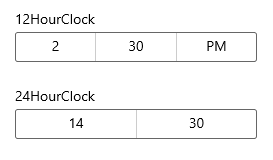
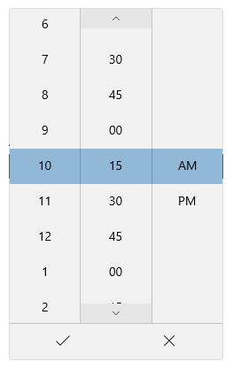

<!-- Class syntax.
public class TimePicker : Windows.UI.Xaml.Controls.Control, Windows.UI.Xaml.Controls.ITimePicker, Windows.UI.Xaml.Controls.ITimePicker2
-->

# Windows.UI.Xaml.Controls.TimePicker

## -description
Represents a control that allows a user to pick a time value.


## -xaml-syntax
```xaml
<TimePicker .../>

```

## -remarks

Use a `TimePicker` to let a user enter a single time value. You can customize the `DatePicker` to use a 12-hour or 24-hour clock.


For more info, design guidance, and code examples, see [Time picker](/windows/uwp/design/controls-and-patterns/time-picker).

### 12-hour and 24-hour clocks

By default, the time picker shows a 12-hour clock with an AM/PM selector. You can set the [ClockIdentifier](timepicker_clockidentifier.md) property to "24HourClock" to show a 24-hour clock instead.

```xaml
<TimePicker Header="12HourClock" SelectedTime="14:30"/>
<TimePicker Header="24HourClock" SelectedTime="14:30" ClockIdentifier="24HourClock"/>
```



### Minute increment

You can set the [MinuteIncrement](timepicker_minuteincrement.md) property to indicate the time increments shown in the minute picker. For example, 15 specifies that the `TimePicker` minute control displays only the choices 00, 15, 30, 45.

```xaml
<TimePicker MinuteIncrement="15"/>
```



### Time values

The time picker control has both [Time](timepicker_time.md) / [TimeChanged](timepicker_timechanged.md) and [SelectedTime](timepicker_selectedtime.md) / [SelectedTimeChanged](timepicker_selectedtimechanged.md) APIs. The difference between these is that `Time` is not nullable, while `SelectedTime` is nullable.

The value of `SelectedTime` is used to populate the time picker and is `null` by default. If `SelectedTime` is `null`, the `Time` property is set to a [TimeSpan](/dotnet/api/system.timespan?view=dotnet-uwp-10.0&preserve-view=true) of 0; otherwise, the `Time` value is synchronized with the `SelectedTime` value. When `SelectedTime` is `null`, the picker is 'unset' and shows the field names instead of a time.


#### Initializing a time value

In code, you can initialize the time properties to a value of type `TimeSpan`:

```csharp
TimePicker timePicker = new TimePicker
{
    SelectedTime = new TimeSpan(14, 15, 00) // Seconds are ignored.
};
```

You can set the time value as an attribute in XAML. This is probably easiest if you're already declaring the `TimePicker` object in XAML and aren't using bindings for the time value. Use a string in the form *Hh:Mm* where *Hh* is hours and can be between 0 and 23 and *Mm* is minutes and can be between 0 and 59.

```xaml
<TimePicker SelectedTime="14:15"/>
```

### Using the time values

To use the time value in your app, you typically use a data binding to the [SelectedTime](/uwp/api/windows.ui.xaml.controls.timepicker.selectedtime) or [Time](/uwp/api/windows.ui.xaml.controls.timepicker.time) property, use the time properties directly in your code, or handle the [SelectedTimeChanged](/uwp/api/windows.ui.xaml.controls.timepicker.selectedtimechanged) or [TimeChanged](/uwp/api/windows.ui.xaml.controls.timepicker.timechanged) event.

> [!TIP]
> For an example of using a `DatePicker` and `TimePicker` together to update a single `DateTime` value, see [Calendar, date, and time controls - Use a date picker and time picker together](/windows/uwp/design/controls-and-patterns/date-and-time#use-a-date-picker-and-time-picker-together).

### Control style and template

You can modify the default [Style](../windows.ui.xaml/style.md) and [ControlTemplate](controltemplate.md) to give the control a unique appearance. For information about modifying a control's style and template, see [Styling controls](/windows/uwp/controls-and-patterns/styling-controls). The default style, template, and resources that define the look of the control are included in the `generic.xaml` file. For design purposes, `generic.xaml` is available locally with the SDK or NuGet package installation. The default locations are:

- **WinUI Styles (recommended):** When you use the updated styles from WinUI 2.6 or later, `\Users\<username>\.nuget\packages\microsoft.ui.xaml\<version>\lib\uap10.0\Microsoft.UI.Xaml\Themes\generic.xaml`.
- **Non-WinUI styles:** When you use the built-in styles, `%ProgramFiles(x86)%\Windows Kits\10\DesignTime\CommonConfiguration\Neutral\UAP\<SDK version>\Generic\generic.xaml`.

Styles and resources from different versions of the SDK might have different values.

XAML also includes resources that you can use to modify the colors of a control in different visual states without modifying the control template. Modifying these resources is preferred to setting properties such as [Background](control_background.md) and [Foreground](control_foreground.md). For more info, see the [Light-weight styling](/windows/apps/design/style/xaml-styles#lightweight-styling) section of the [XAML styles](/windows/apps/design/style/xaml-styles) article. Light-weight styling resources are available starting in Windows 10, version 1607 (SDK 14393).

### Version history

| Windows version | SDK version | Value added |
| -- | -- | -- |
| 1607 | 14393 | LightDismissOverlayMode |
| 1809 | 17763 | SelectedTime |
| 1809 | 17763 | SelectedTimeChanged |

## -examples

> [!TIP]
> For more info, design guidance, and code examples, see [Time picker](/windows/apps/design/controls/time-picker).

> [!div class="nextstepaction"]
> [Open the WinUI 2 Gallery app and see the TimePicker in action](winui2gallery:/item/TimePicker)

> The **WinUI 2 Gallery** app includes interactive examples of most WinUI 2 controls, features, and functionality. Get the app from the [Microsoft Store](https://www.microsoft.com/store/productId/9MSVH128X2ZT) or get the source code on [GitHub](https://github.com/Microsoft/WinUI-Gallery/tree/winui2).

This example shows how to create a simple time picker with a header in XAML or in code.

```xaml
<TimePicker x:Name="arrivalTimePicker" Header="Arrival time"/>
```

```csharp
TimePicker arrivalTimePicker = new TimePicker();
arrivalTimePicker.Header = "Arrival time";
```

## -see-also
[Time picker overview](/windows/uwp/design/controls-and-patterns/time-picker), [Windows.Globalization.ClockIdentifiers](../windows.globalization/clockidentifiers.md), [System.TimeSpan (C#/VB)](/dotnet/api/system.timespan?view=dotnet-uwp-10.0&preserve-view=true), [Windows::Foundation::TimeSpan (C++)](/windows/desktop/api/windows.foundation/ns-windows-foundation-timespan), [DatePicker](datepicker.md), [Controls list](/windows/uwp/design/controls-and-patterns/), [Controls by function](/windows/uwp/controls-and-patterns/controls-by-function)
